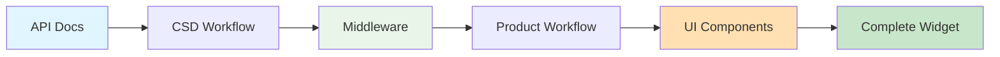

# Cursor Rules Documentation

This directory contains AI assistant rules for automating development workflows. Each `.mdc` file defines specific instructions for generating and managing different types of development artifacts.

## Available Rules

### 📋 Project Planning & Requirements
- **`create-prd.mdc`** - Generates Product Requirements Documents from user prompts
- **`generate-tasks.mdc`** - Creates detailed task lists from PRDs, middleware plans, or UI plans for implementation
- **`process-task-list.mdc`** - Manages task execution with proper testing and commit protocols

### 🏗️ Middleware Development Workflow (CSD)
- **`generate-middleware-plan.mdc`** - Creates comprehensive middleware architecture plans from API documentation
- **`generate-class-structure.mdc`** - Reference architecture for UI-agnostic middleware systems

### 🎨 UI/UX Development Workflow (Product)
- **`generate-ui-plan.mdc`** - Creates comprehensive UI/UX plans from middleware architecture for responsive, accessible interfaces

## 🔄 Development Workflows Overview

The development process is divided into two main workflows that work together to create complete Fliplet widgets:

```mermaid
graph TB
    A[API Documentation<br/>@docs/API/] --> B[generate-middleware-plan.mdc]
    B --> C[middleware-plan-[name].md<br/>📄 Architecture Plan]
    C --> D{Human Review<br/>✅ Architecture}
    D --> E[generate-tasks.mdc]
    E --> F[tasks-middleware-plan-[name].md<br/>📋 Task List]
    F --> G{Human Review<br/>✅ Task Breakdown}
    G --> H[process-task-list.mdc]
    H --> I[Generated Middleware<br/>🎯 Implementation]

    style A fill:#e1f5fe
    style C fill:#f3e5f5
    style F fill:#fff3e0
    style I fill:#e8f5e8
```

### Step 1: Architecture Planning

**Purpose:** Analyze API documentation and create a comprehensive middleware architecture plan.

```bash
# User Command: Reference generate-middleware-plan.mdc
# Input: @docs/API/ documentation files
# Output: /tasks/middleware-plan-[project-name].md
```

**What It Creates:**
- Complete architecture overview
- Class hierarchy design
- API service mapping
- Workflow identification
- State management strategy
- Error handling approach
- Integration patterns

**Review Point:** Human reviews the architecture plan for completeness and accuracy.

### Step 2: Task Generation

**Purpose:** Convert the architecture plan into actionable development tasks.

```bash
# User Command: Reference generate-tasks.mdc with middleware plan
# Input: @tasks/middleware-plan-[project-name].md
# Output: /tasks/tasks-middleware-plan-[project-name].md
```

**What It Creates:**
- Parent tasks for major components
- Detailed sub-tasks for implementation
- File creation/modification list
- Testing requirements
- Dependencies and sequence

**Review Point:** Human reviews the task breakdown before implementation begins.

### Step 3: Implementation Execution

**Purpose:** Execute tasks with proper protocols, testing, and version control.

```bash
# User Command: Reference process-task-list.mdc
# Input: /tasks/tasks-middleware-plan-[project-name].md
# Output: Complete middleware implementation
```

**What It Does:**
- Implements one sub-task at a time
- Runs tests after each completion
- Creates proper git commits
- Updates task list progress
- Maintains file documentation

**Review Points:** Human approval required before each sub-task execution.

## 📁 Generated File Structure

### Planning Phase Output
```
/tasks/
├── middleware-plan-[project-name].md    # Architecture plan
└── tasks-middleware-plan-[project-name].md  # Implementation tasks
```

### Implementation Phase Output
```
/src/middleware/
├── core/
│   ├── BaseMiddleware.js
│   ├── StateManager.js
│   ├── ValidationEngine.js
│   ├── ErrorHandler.js
│   └── DataMapper.js
├── api/
│   ├── ApiClient.js
│   ├── [Domain]ApiService.js
│   └── ...
├── controllers/
│   ├── WorkflowManager.js
│   ├── [Process]Controller.js
│   └── ...
├── config/
│   ├── endpoints.js
│   ├── validation-rules.js
│   ├── error-messages.js
│   └── workflows.js
└── middleware.js
```

## 🎯 Key Benefits

### **Incremental Validation**
- Review architecture before implementation
- Validate task breakdown before coding
- Approve each implementation step

### **Quality Assurance**
- Comprehensive testing at each step
- Proper version control protocols
- Documentation maintenance

### **Risk Mitigation**
- Early detection of architecture issues
- Clear dependencies and sequencing
- Rollback capabilities at each stage

### **Reusability**
- Consistent patterns across projects
- Proven workflow templates
- Modular rule system

## 🎨 Product Development Workflow (UI/UX)

The Product workflow focuses on creating user interfaces that integrate with the middleware layer. This process ensures high-quality, responsive, and customizable UI components that meet Fliplet's branding standards.

```mermaid
graph TB
    A[Middleware Implementation<br/>@src/middleware/] --> B[generate-ui-plan.mdc]
    B --> C[ui-plan-[name].md<br/>🎨 UI/UX Plan]
    C --> D{Review<br/>✅ PM & Design}
    D --> E[generate-tasks.mdc]
    E --> F[tasks-ui-plan-[name].md<br/>📋 Task List]
    F --> G{Review<br/>✅ Technical}
    G --> H[process-task-list.mdc]
    H --> I[Vue.js Components<br/>🖼️ Implementation]

    style A fill:#e8f5e8
    style C fill:#ffe0b2
    style F fill:#fff3e0
    style I fill:#e1f5fe
```

### Step 1: UI/UX Planning

**Purpose:** Analyze middleware architecture and create a comprehensive UI/UX plan.

```bash
# User Command: Reference generate-ui-plan.mdc
# Input: @src/middleware/ implementation files
# Output: /tasks/ui-plan-[project-name].md
```

**What It Creates:**
- User journey mapping
- Component architecture
- Responsive design strategy
- Theming & customization framework
- Accessibility specifications
- Integration patterns with middleware

**Review Point:** Product Managers and Designers review for UX quality and brand compliance.

### Step 2: Task Generation

**Purpose:** Convert the UI/UX plan into actionable development tasks.

```bash
# User Command: Reference generate-tasks.mdc with UI plan
# Input: @tasks/ui-plan-[project-name].md
# Output: /tasks/tasks-ui-plan-[project-name].md
```

**What It Creates:**
- Component development tasks
- Styling and theming tasks
- Integration tasks
- Accessibility implementation
- Testing requirements

**Review Point:** Technical team reviews task breakdown before implementation.

### Step 3: Implementation Execution

**Purpose:** Build Vue.js components with proper testing and documentation.

```bash
# User Command: Reference process-task-list.mdc
# Input: /tasks/tasks-ui-plan-[project-name].md
# Output: Complete Vue.js UI implementation
```

**What It Does:**
- Creates Vue.js components
- Implements responsive designs
- Adds accessibility features
- Integrates with middleware
- Maintains design documentation

## 🏗️ CSD Development Workflow (Middleware)

The CSD (Core Services Development) workflow focuses on creating UI-agnostic middleware that provides business logic and API integration.

```mermaid
graph TB
    A[API Documentation<br/>@docs/API/] --> B[generate-middleware-plan.mdc]
    B --> C[middleware-plan-[name].md<br/>📄 Architecture Plan]
    C --> D{Human Review<br/>✅ Architecture}
    D --> E[generate-tasks.mdc]
    E --> F[tasks-middleware-plan-[name].md<br/>📋 Task List]
    F --> G{Human Review<br/>✅ Task Breakdown}
    G --> H[process-task-list.mdc]
    H --> I[Generated Middleware<br/>🎯 Implementation]

    style A fill:#e1f5fe
    style C fill:#f3e5f5
    style F fill:#fff3e0
    style I fill:#e8f5e8
```

### Step 1: Architecture Planning

**Purpose:** Analyze API documentation and create a comprehensive middleware architecture plan.

```bash
# User Command: Reference generate-middleware-plan.mdc
# Input: @docs/API/ documentation files
# Output: /tasks/middleware-plan-[project-name].md
```

**What It Creates:**
- Complete architecture overview
- Class hierarchy design
- API service mapping
- Workflow identification
- State management strategy
- Error handling approach
- Integration patterns

**Review Point:** Human reviews the architecture plan for completeness and accuracy.

### Step 2: Task Generation

**Purpose:** Convert the architecture plan into actionable development tasks.

```bash
# User Command: Reference generate-tasks.mdc with middleware plan
# Input: @tasks/middleware-plan-[project-name].md
# Output: /tasks/tasks-middleware-plan-[project-name].md
```

**What It Creates:**
- Parent tasks for major components
- Detailed sub-tasks for implementation
- File creation/modification list
- Testing requirements
- Dependencies and sequence

**Review Point:** Human reviews the task breakdown before implementation begins.

### Step 3: Implementation Execution

**Purpose:** Execute tasks with proper protocols, testing, and version control.

```bash
# User Command: Reference process-task-list.mdc
# Input: /tasks/tasks-middleware-plan-[project-name].md
# Output: Complete middleware implementation
```

**What It Does:**
- Implements one sub-task at a time
- Runs tests after each completion
- Creates proper git commits
- Updates task list progress
- Maintains file documentation

**Review Points:** Human approval required before each sub-task execution.

## 🔄 Complete Development Process

The full development process combines both workflows:



1. **CSD Team** creates middleware from API documentation
2. **Product Team** creates UI/UX plan from middleware
3. **Development** implements both layers incrementally
4. **Integration** combines middleware and UI into complete widget

## 🚀 Usage Examples

### Example 1: Publishing Dashboard (Complete Process)

#### CSD Workflow - Middleware Development

1. **Generate Middleware Plan:**
   ```
   Reference: @.cursor/rules/generate-middleware-plan.mdc
   Context: Analyze @docs/API/ for publishing dashboard
   Output: /tasks/middleware-plan-publishing-dashboard.md
   ```

2. **Generate Middleware Tasks:**
   ```
   Reference: @.cursor/rules/generate-tasks.mdc
   Input: @tasks/middleware-plan-publishing-dashboard.md
   Output: /tasks/tasks-middleware-plan-publishing-dashboard.md
   ```

3. **Execute Middleware Implementation:**
   ```
   Reference: @.cursor/rules/process-task-list.mdc
   Input: @tasks/tasks-middleware-plan-publishing-dashboard.md
   Output: Complete middleware system in /src/middleware/
   ```

#### Product Workflow - UI Development

4. **Generate UI/UX Plan:**
   ```
   Reference: @.cursor/rules/generate-ui-plan.mdc
   Context: Analyze @src/middleware/ implementation
   Output: /tasks/ui-plan-publishing-dashboard.md
   ```

5. **Generate UI Tasks:**
   ```
   Reference: @.cursor/rules/generate-tasks.mdc
   Input: @tasks/ui-plan-publishing-dashboard.md
   Output: /tasks/tasks-ui-plan-publishing-dashboard.md
   ```

6. **Execute UI Implementation:**
   ```
   Reference: @.cursor/rules/process-task-list.mdc
   Input: @tasks/tasks-ui-plan-publishing-dashboard.md
   Output: Complete Vue.js UI in /src/components/
   ```

### Example 2: User Management System

Follow the same 6-step process with user management API documentation and requirements.

## 📝 Rule File Conventions

### File Naming
- Use kebab-case: `generate-middleware-plan.mdc`
- Include action verb: `generate`, `create`, `process`
- Be descriptive: `middleware-plan` vs `plan`

### File Structure
```markdown
---
description: Brief description of what the rule does
globs:
alwaysApply: false
---
# Rule: Descriptive Title

## Goal
[Clear statement of what this rule achieves]

## Process
[Step-by-step instructions for the AI]

## Output
[Description of generated artifacts]

## Standards
[Coding/documentation standards to follow]
```

### Documentation Standards
- Include comprehensive examples
- Specify input/output formats
- Define error handling approaches
- Provide integration patterns

## 🔧 Maintenance

### Adding New Rules
1. Follow the established file structure
2. Include comprehensive documentation
3. Provide clear examples
4. Test with real scenarios

### Updating Existing Rules
1. Maintain backward compatibility
2. Update this README if workflow changes
3. Test updated rules thoroughly
4. Document breaking changes

### Best Practices
- Keep rules focused and single-purpose
- Leverage existing rules when possible
- Include proper error handling
- Maintain clear documentation
