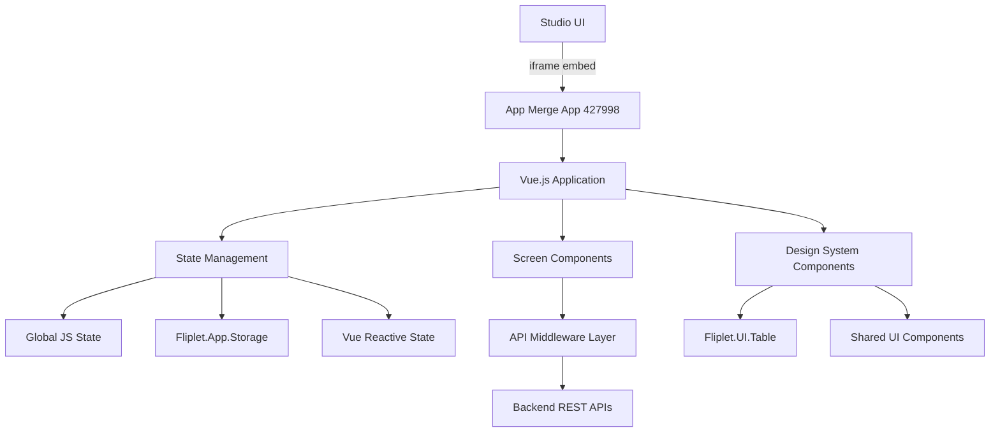

# App Merge UI - Implementation Overview

## Project Summary

For project context and requirements, see [../README.md](../README.md) and [../01-project-prd.md](../01-project-prd.md).

## Implementation Approach

- **Vue.js 3** for reactive state management and component architecture
- **Fliplet.UI.Table** library for advanced tabular functionality
- **Modular middleware layer** following [MIDDLEWARE_GUIDELINES.md](../MIDDLEWARE_GUIDELINES.md)
- **Design system** with shared components for consistency
- **Incremental delivery** with mock data first, then API integration

## Architecture Diagram



## Implementation Phases

For detailed phase descriptions, see [IMPLEMENTATION.md](../IMPLEMENTATION.md):

- **[Phase 1](./phase-1-foundation/)**: Foundation & Design System
- **[Phase 2](./phase-2-screens/)**: Screen-by-Screen Implementation
- **[Phase 3](./phase-3-integration/)**: API Integration & Testing
- **[Phase 4](./phase-4-polish/)**: Polish & Studio Integration

## Key Files Structure

```
App 427998
├── Global CSS
│   ├── Design tokens
│   ├── Component styles
│   ├── Table styles
│   └── Responsive breakpoints
├── Global JS
│   ├── Vue.js import
│   ├── Fliplet.UI.Table dependency
│   ├── State management
│   ├── API middleware
│   ├── Shared components
│   └── Utilities
└── Screens
    ├── == [Design System] == (Component showcase)
    ├── == [API Tester] == (Developer tool)
    ├── dashboard.html (Dashboard)
    ├── select-destination.html (Step 1)
    ├── configure-merge.html (Step 2)
    ├── review-merge.html (Step 3)
    ├── merge-progress.html (Execution)
    └── merge-complete.html (Completion)
```

## Dependencies

- **Vue.js 3** (CDN): https://cdn.jsdelivr.net/npm/vue@3/dist/vue.global.js
- **Fliplet.UI.Table**: Added via `fliplet-table` library dependency
- **Bootstrap 4**: Already available in Fliplet
- **FontAwesome**: Already available in Fliplet

